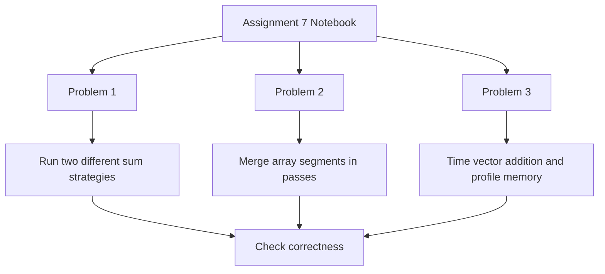

# LAB 7: CUDA Programming Assignment

This assignment uses three CUDA problems to show how GPU threads can be assigned different work, how data can be processed in parallel across many threads, and how memory movement affects measured performance. The notebook runs each task separately and records the output for validation.

## Assignment Goals

- Show how a CUDA kernel can assign different work to different threads
- Demonstrate a parallel merge sort workflow built from repeated merge passes
- Measure vector addition performance and compare it with theoretical bandwidth
- Use profiling output to interpret kernel execution and memory activity

## Assignment at a Glance

| Problem   | Focus                   | What It Demonstrates                                                                        |
| --------- | ----------------------- | ------------------------------------------------------------------------------------------- |
| Problem 1 | Thread-level task split | Two CUDA threads compute the same sum using different methods and verify the result matches |
| Problem 2 | Parallel sorting        | A bottom-up merge sort combines array segments across GPU threads                           |
| Problem 3 | Memory throughput       | A vector-add kernel is timed and compared with theoretical bandwidth                        |

## Overall Workflow

## Detailed Problem Breakdown

### Problem 1: Diverse Tasks in CUDA Threads

This problem uses a very small kernel to show that thread identity can control behavior inside the same launch. One thread computes the sum of numbers iteratively, while another thread computes the same result with the arithmetic formula. The purpose is to confirm that both approaches produce the same answer and to show how a kernel can branch by thread ID when tasks are independent.

What to observe:

- Both methods should return the same final sum
- The result acts as a correctness check for the kernel
- The example shows how different CUDA threads can take on different roles within one launch

### Problem 2: Parallel Merge Sort

This problem implements a bottom-up merge sort pattern. Instead of sorting everything in one step, the array is merged in stages: small sorted ranges are combined first, then larger ranges, and so on until the entire array is ordered. The idea is to demonstrate a classic divide-and-merge workflow on the GPU.

What to observe:

- The array becomes increasingly more sorted after each merge pass
- The output preview should show values in ascending order
- The approach highlights how repeated kernel launches can build a complete sorting algorithm

### Problem 3: Vector Addition and Bandwidth Analysis

This problem focuses on performance measurement rather than algorithm complexity. A large vector addition kernel is executed, and its runtime is used to estimate bandwidth. The measured value is then compared with the GPU's theoretical memory bandwidth to show the difference between peak capability and real application performance.

What to observe:

- The kernel execution time reported by CUDA timing functions
- The theoretical bandwidth computed from device properties
- The measured bandwidth calculated from the amount of data processed during the kernel
- The profiling output that shows how much time is spent in kernel execution versus data transfer

## Key Takeaways

- CUDA thread IDs can be used to split work cleanly across independent tasks
- A bottom-up merge strategy is a practical way to express sorting in stages
- Memory bandwidth measurements are useful for understanding real GPU performance
- Profiling helps separate kernel behavior from host-device transfer overhead

## Expected Results

- Problem 1 should report matching sums from both methods
- Problem 2 should print a sorted preview of the data after execution
- Problem 3 should report kernel time, theoretical bandwidth, and measured bandwidth

## Deliverables

- Assignment7.ipynb
- Generated CUDA source files created during notebook execution
- Console output and profiling results for each problem

## Notes

- The notebook is intended for a CUDA-enabled environment
- The README is intentionally code-free and focuses on the assignment narrative
- Screenshots or a short results table can be added later if needed
